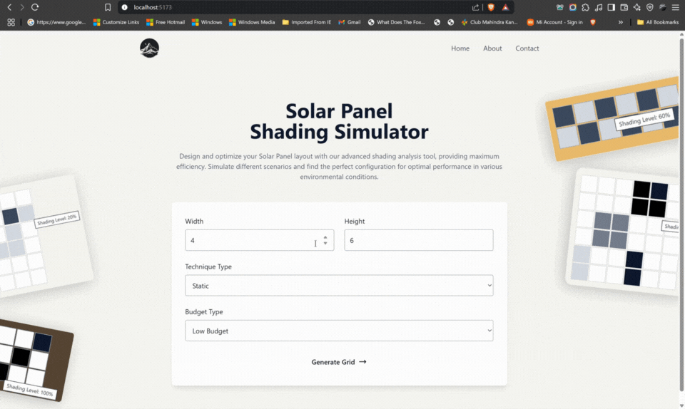

# SmartSolar

SmartSolar is a modern web application built with React and Vite that helps users manage and monitor solar energy systems. The application provides an intuitive interface for tracking solar panel performance, energy consumption, and environmental impact.



## Features

- Real-time solar panel monitoring
- Energy consumption tracking
- Environmental impact analysis
- Modern, responsive UI built with Tailwind CSS
- Markdown support for documentation

## Tech Stack

- React 19
- Vite 6
- Tailwind CSS 4
- OpenAI Integration
- React Markdown
- ESLint for code quality

## Getting Started

### Prerequisites

- Node.js (Latest LTS version recommended)
- npm or yarn package manager

### Installation

1. Clone the repository:
```bash
git clone https://github.com/yourusername/SmartSolar.git
cd SmartSolar
```

2. Install dependencies:
```bash
npm install
# or
yarn install
```

3. Start the development server:
```bash
npm run dev
# or
yarn dev
```

The application will be available at `http://localhost:5173`

### Building for Production

To create a production build:

```bash
npm run build
# or
yarn build
```

## Available Scripts

- `npm run dev` - Start development server
- `npm run build` - Build for production
- `npm run preview` - Preview production build
- `npm run lint` - Run ESLint

## Contributing

1. Fork the repository
2. Create your feature branch (`git checkout -b feature/AmazingFeature`)
3. Commit your changes (`git commit -m 'Add some AmazingFeature'`)
4. Push to the branch (`git push origin feature/AmazingFeature`)
5. Open a Pull Request

## License

This project is licensed under the MIT License - see the LICENSE file for details.

## Contact
Project Link: [https://github.com/SHIVANSHUDAHIYA/SmartSolar](https://github.com/SHIVANSHUDAHIYA/SmartSolar)
